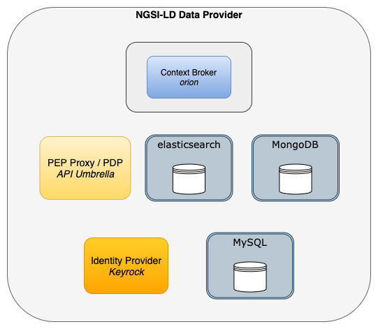
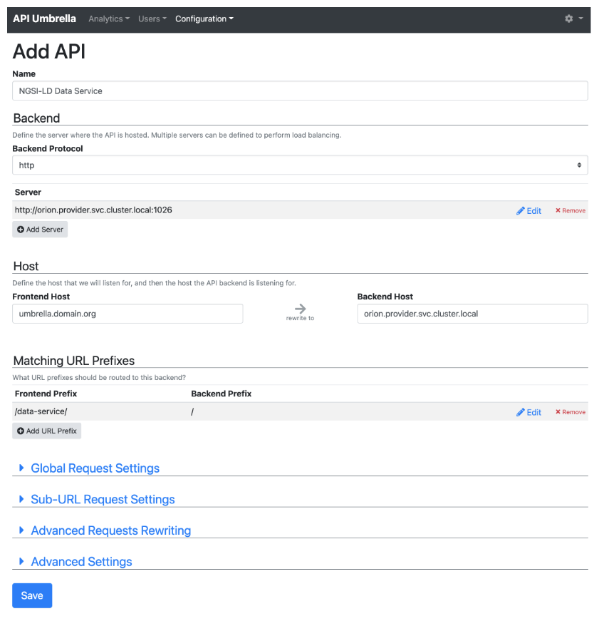

# NGSI-LD Data Provider

This describes how to set up an environment of a data service provider based on 
the `orion-ld` Context Broker with NGSI-LD on Kubernetes with Helm. The Identity and 
Access Management (IAM) is performed by API Umbrella and optionally Keyrock.

The environment consists of the following components
* MongoDB
* orion
* Elasticsearch
* API Umbrella
* Keyrock (optional)
* MySQL (in case Keyrock is used)
as depicted in the following diagram:


This description provides examples of the [Helm values files](./values) which show the minimum configuration 
parameters to be set. Adapt these for your setup before proceeding with the instructions.

The helm charts of the FIWARE Generic enablers with all possible configuration values can be found here:
* [orion](https://github.com/FIWARE/helm-charts/tree/main/charts/orion)
* [API Umbrella](https://github.com/FIWARE/helm-charts/tree/main/charts/api-umbrella)
* [Keyrock](https://github.com/FIWARE/helm-charts/tree/main/charts/keyrock)

We will assume that all components will be deployed within the namespace `provider`.
```shell
kubectl create ns provider
```


## MongoDB

First modify the [Helm values file](./values/values-mongodb.yml) according to your environment and 
then deploy `mongodb`:
```shell
helm repo add bitnami https://charts.bitnami.com/bitnami
helm repo update
helm install -f ./values/values-mongodb.yml --namespace provider mongodb bitnami/mongodb
```


## Context Broker orion

First modify the [Helm values file](./values/values-orion.yml) according to your environment and 
then deploy `orion`:
```shell
helm repo add fiware https://fiware.github.io/helm-charts/
helm repo update
helm install -f ./values/values-orion.yml --namespace provider orion fiware/orion
```


## Elasticsearch

First modify the [Helm values file](./values/values-elastic.yml) according to your environment and 
then deploy `elasticsearch`:
```shell
helm repo add elastic https://helm.elastic.co
helm repo update
helm install -f ./values/values-elastic.yml --namespace provider elasticsearch elastic/elasticsearch --version 7.5.1
```


## API Umbrella

API Umbrella is used as Policy Enforcement Point, and can be also used as Policy Decision Point. 
In case that Keyrock should take over the decisions, instances of a MySQL database and Keyrock need to be additionally 
deployed, as shown in the next paragraphs.

First create the necessary database and user within the MongoDB. This requires to enter a shell within the 
MongoDB pod, starting the MongoDB client and perform the commands below for creating the user.
```shell
# Enter pod
kubectl exec -n provider --stdin --tty mongodb-xyz -- /bin/bash

# Start mongo client
mongo -u root     # (provide MongoDB root PW)

# Within mongo client:
> use api_umbrella
> db.createUser({user: "api_umbrella", pwd: "api-umbrella-password", roles: [{role: "readWrite", db: "api_umbrella"}]})
```

Now modify the [API Umbrella values file](./values/values-umbrella.yml) according to your setup and perform 
the deployment using Helm.
```shell
helm repo add fiware https://fiware.github.io/helm-charts/
helm repo update
helm install -f ./values/values-umbrella.yml --namespace provider api-umbrella fiware/api-umbrella
```

When first opening the page (https://umbrella.domain.org/admin), the credentials of the admin user can be set.

Within the Admin UI, create a new API Backend for the Orion Context Broker, as depicted in the following picture.

Additionally configure the backend according to your authentication and authorisation requirements.


## MySQL (optional: only required for Keyrock)

First modify the [values file](./values/values-mysql.yml) according to your needs and then deploy the MySQL database using `helm`. 
```shell
helm repo add t3n https://storage.googleapis.com/t3n-helm-charts
helm repo update
helm install -f ./values/values-mysql.yml --namespace provider mysql t3n/mysql --version 0.1.0
```


## Keyrock (optional)

The usage of the Keyrock Identity Provider depends on the actual access management 
and authorisation mechanism to be used in API Umbrella. A common setup where Keyrock 
would be required is, e.g., when
* Authorisation decisions are to be performed by Keyrock
* User profiles and their roles are stored within Keyrock


Modify the Keyrock [values file](./values/values-keyrock.yml) according to your needs and deploy the Keyrock Identity Provider. 
Make sure to setup an Ingress or OpenShift route in the values file for external 
access of the UI (e.g. https://keyrock.domain.org).
```shell
# Deploy Keyrock
helm install -f ./values/values-keyrock.yml --namespace provider keyrock fiware/keyrock
```

In a browser open the Keyrock UI (e.g. https://keyrock.domain.org) and login with the admin credentials provided in 
the values file.
